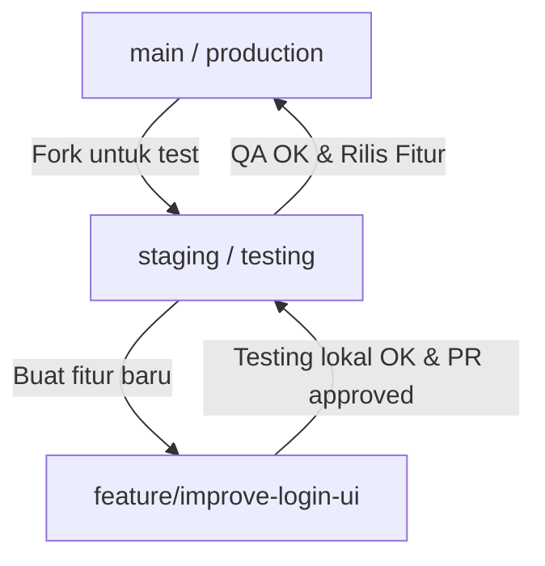

# 🚀 HERD Development & Workflow Guide

Panduan ini dibuat untuk membantu kamu melakukan pengembangan (*improvement*), testing, dan kolaborasi pada sistem HERD secara aman dan profesional layaknya di startup teknologi.

---

## 📌 1. Git Branching Strategy (Alur Kerja Fitur)

Untuk mencegah kode produksi (*production*) rusak akibat perubahan yang belum teruji, kita menggunakan pembagian cabang (*branching*) di Git.



### 🔹 Cabang Utama (Branch)
1.  **`main`**:
    *   **Status**: Suci / Stabil.
    *   **Isi**: Kode yang sedang berjalan di server production dan diakses oleh pengguna asli.
    *   **Aturan**: *Jangan pernah melakukan push langsung ke branch ini!* Semua perubahan harus melalui Pull Request (PR).
2.  **`staging`**:
    *   **Status**: Testing Environment.
    *   **Isi**: Gabungan dari fitur-fitur baru yang sedang diuji coba sebelum dilepas ke production.
    *   **Aturan**: Di-deploy otomatis ke server staging/dummy untuk QA (Quality Assurance).
3.  **`feature/nama-fitur`** atau **`bugfix/nama-bug`**:
    *   **Status**: Development.
    *   **Isi**: Tempat kamu bekerja sehari-hari untuk membuat fitur baru atau membetulkan bug.

---

## 📝 2. Git Command Cheat Sheet (Contekan Perintah Git)

Berikut langkah demi langkah dari mulai membuat fitur sampai fitur itu rilis ke production:

### Langkah 1: Update branch lokal kamu dengan remote repository
```bash
git checkout main
git pull origin main
```

### Langkah 2: Buat branch baru untuk fitur kamu
*Gunakan format `feature/deskripsi-singkat` atau `bugfix/deskripsi-singkat`*
```bash
git checkout -b feature/improve-login-ui
```

### Langkah 3: Coding & Commit secara bertahap
*Setelah melakukan perubahan pada file:*
```bash
# Cek file apa saja yang berubah
git status

# Tambahkan perubahan ke staging area
git add .

# Buat commit dengan pesan yang deskriptif
git commit -m "feat: memperbarui tampilan sidebar dan tombol login"
```

### Langkah 4: Push branch kamu ke GitHub/GitLab
```bash
git push origin feature/improve-login-ui
```

### Langkah 5: Buka Pull Request (PR)
1. Buka repositori GitHub/GitLab kamu di browser.
2. Kamu akan melihat tombol **"Compare & pull request"**.
3. Arahkan PR kamu dari `feature/improve-login-ui` ke branch `staging` (untuk ditesting) atau `main`.
4. Minta rekan tim atau lakukan review sendiri sebelum menggabungkannya (*Merge*).

---

## 🗄️ 3. Panduan Database Lokal (Sangat Penting!)

Di laptop kamu, database PostgreSQL berjalan di dalam Docker container. Kamu **tidak menggunakan database production** saat melakukan testing.

### 🔹 Spesifikasi Koneksi Database Lokal
Berikut credential untuk menghubungkan database client (DBeaver, TablePlus, pgAdmin) dari laptop kamu ke database PostgreSQL lokal di Docker:

*   **DBMS**: PostgreSQL
*   **Host**: `localhost` atau `127.0.0.1`
*   **Port**: `5433` *(Perhatikan: Di dalam Docker port-nya 5432, tapi diekspos ke laptop kamu di port **5433** seperti tertera di docker-compose.yaml)*
*   **Database Name**: `Collar_to_Gateway`
*   **Username**: `postgres`
*   **Password**: `postgre`

### 🔹 Cara Akses Database Lokal via pgAdmin Web
Sistem HERD sudah menyediakan pgAdmin langsung di dalam Docker Compose.
1. Buka browser dan buka: **`http://localhost:5050`**
2. Login menggunakan akun pgAdmin berikut:
   *   **Email**: `admin@herd.my.id`
   *   **Password**: `H3ctr@Adm1n#2026`
3. Setelah masuk, daftarkan server baru dengan spesifikasi koneksi di atas (gunakan host `db` jika menghubungkan sesama kontainer Docker, atau `localhost`/`127.0.0.1` dengan port `5433` jika dari luar docker).

### 🔹 Cara Melakukan Perubahan Schema DB (Migration)
Jika kamu ingin menambah tabel atau kolom baru di database lokal:
1. Jalankan query SQL kamu di DB lokal (melalui pgAdmin atau DBeaver).
2. Simpan file query tersebut di folder `2. Hectra Backend/db/` dengan format nama yang jelas, misal: `2. Hectra Backend/db/migration_tambah_tabel_xyz.sql`.
3. File SQL ini nanti akan dijalankan di database server staging dan production saat deployment agar struktur database-nya sama.

---

## 💻 4. Langkah Menjalankan Proyek Secara Lokal

Untuk mulai melakukan improvement, pastikan kedua bagian ini berjalan di laptopmu:

### 🟢 A. Jalankan Backend & Database (Docker Compose)
1. Buka terminal di folder [2. Hectra Backend](file:///Volumes/Kerberos/Github-Repo/hq/2.%20Hectra%20Backend)
2. Jalankan docker-compose:
   ```bash
   docker-compose up -d
   ```
   *Perintah ini akan menyalakan database, Redis, MQTT, pgAdmin, dan server API di background.*
3. Cek apakah kontainer berjalan lancar:
   ```bash
   docker-compose ps
   ```

### 🔵 B. Jalankan Frontend (Vite)
1. Buka terminal baru di folder [1. Software_Hectra_Dashboard](file:///Volumes/Kerberos/Github-Repo/hq/1.%20Software_Hectra_Dashboard)
2. Install dependensi jika pertama kali clone / ada package baru:
   ```bash
   npm install
   ```
3. Jalankan server development:
   ```bash
   npm run dev
   ```
4. Buka aplikasi di browser melalui URL yang ditampilkan (default: `http://localhost:5173`).

---

## ⚠️ Aturan Emas Pengembangan (Golden Rules)
1. **Uji Coba Dulu Secara Lokal**: Pastikan fitur yang kamu buat tidak error di laptopmu sebelum di-commit.
2. **Jangan Simpan Kunci Rahasia**: Jangan pernah memasukkan API Key asli atau password production langsung ke dalam file kode. Gunakan file `.env` yang sudah di-ignore oleh Git.
3. **Selalu Tarik Kode Terbaru**: Sebelum mulai coding fitur baru, pastikan jalankan `git pull origin main` agar kode di laptopmu tidak tertinggal dengan yang di server.
